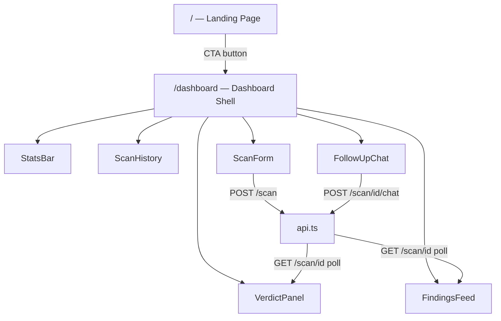

# Here's the full plan. Let me walk you through it:

---

## Architecture



---

## Plan Summary — 8 Sub-Tasks

| # | Sub-Task | What it does |
|---|----------|--------------|
| 1 | **Foundation** | Install `lucide-react`, `clsx`, `react-markdown` · Define all TypeScript types · API client (`startScan`, `getScan`, `sendChat`) · `layout.tsx` · `globals.css` color tokens |
| 2 | **Landing Page** | Hero · Threat-stat strip · How It Works (3 steps) · Features grid (6 cards) · Footer · CTA → `/dashboard` |
| 3 | **Dashboard Shell** | `/dashboard` route · 2-column layout · `activeScanId` + `scanResult` state · 2-second polling loop |
| 4 | **ScanForm** | Repo URL input · calls `startScan` · loading/error states |
| 5 | **VerdictPanel** | Verdict badge (green/amber/red) · Bob summary · `chain` rendered as markdown · skeleton loading |
| 6 | **FindingsFeed** | Scrollable live findings list · severity icons · auto-scroll · empty state |
| 7 | **FollowUpChat** | Chat thread · user/Bob bubbles · typing indicator · `sendChat` |
| 8 | **ScanHistory + StatsBar** | Past-scan list · aggregate stat tiles · wire history state in dashboard |

---

**Sub-tasks 4–8 are independent of each other** and can be built in any order after the shell (Sub-Task 3) exists.

A few things to confirm before we implement:

1. **Routing** — I've put the dashboard at `/dashboard` and the landing page at `/`. Does that work, or should the dashboard be the root route?
2. **Scan history persistence** — I've designed history as in-memory React state (resets on page refresh). Is that acceptable for the hackathon MVP, or do you want `localStorage` persistence?
3. **`GET /scan/{id}` polling vs. SSE** — I've planned a 2-second poll. Is that confirmed, or does the backend support SSE/WebSocket for live findings?

Once you confirm, switch to **Agent mode** to implement.

---

**Status:** active  **Date:** 2026-09-26

---

### 👤 User

Here's the full plan. Let me walk you through it:

---

## Architecture


---

## Plan Summary — 8 Sub-Tasks

| # | Sub-Task | What it does |
|---|----------|--------------|
| 1 | **Foundation** | Install `lucide-react`, `clsx`, `react-markdown` · Define all TypeScript types · API client (`startScan`, `getScan`, `sendChat`) · `layout.tsx` · `globals.css` color tokens |
| 2 | **Landing Page** | Hero · Threat-stat strip · How It Works (3 steps) · Features grid (6 cards) · Footer · CTA → `/dashboard` |
| 3 | **Dashboard Shell** | `/dashboard` route · 2-column layout · `activeScanId` + `scanResult` state · 2-second polling loop |
| 4 | **ScanForm** | Repo URL input · calls `startScan` · loading/error states |
| 5 | **VerdictPanel** | Verdict badge (green/amber/red) · Bob summary · `chain` rendered as markdown · skeleton loading |
| 6 | **FindingsFeed** | Scrollable live findings list · severity icons · auto-scroll · empty state |
| 7 | **FollowUpChat** | Chat thread · user/Bob bubbles · typing indicator · `sendChat` |
| 8 | **ScanHistory + StatsBar** | Past-scan list · aggregate stat tiles · wire history state in dashboard |

---

**Sub-tasks 4–8 are independent of each other** and can be built in any order after the shell (Sub-Task 3) exists.

A few things to confirm before we implement:

1. **Routing** — I've put the dashboard at `/dashboard` and the landing page at `/`. Does that work, or should the dashboard be the root route?
2. **Scan history persistence** — I've designed history as in-memory React state (resets on page refresh). Is that acceptable for the hackathon MVP, or do you want `localStorage` persistence?
3. **`GET /scan/{id}` polling vs. SSE** — I've planned a 2-second poll. Is that confirmed, or does the backend support SSE/WebSocket for live findings?

Once you confirm, switch to **Agent mode** to implement.

---

### 🤖 Assistant

> 🔧 called: list_files, read_file

Looking at the current state of the codebase before responding.

> 🔧 **list_files** — frontend/src

> 🔧 **read_file** — frontend-plan.md

### 🤖 Assistant

> 🔧 called: read_file, read_file, read_file, read_file, read_file

Let me read the current state of all the existing files before responding:

> 🔧 **read_file** — frontend/src/lib/types.ts

> 🔧 **read_file** — frontend/src/lib/api.ts

> 🔧 **read_file** — frontend/src/app/layout.tsx

> 🔧 **read_file** — frontend/src/app/page.tsx

> 🔧 **read_file** — frontend/src/app/globals.css

### 🤖 Assistant

> 🔧 called: start_subtask

Good — I have the full picture. All source files are empty, the plan is detailed, and the three open questions from the plan need answering before implementation kicks off. Let me address them directly and confirm the approach:

---

## Answers to your three questions

**1. Routing — `/` landing page vs. `/dashboard` root**
The plan is correct as written. `/` as a marketing landing page with a CTA to `/dashboard` is the right call — it gives the project a proper entry point and separates concerns cleanly. No change needed.

**2. Scan history persistence — in-memory vs. `localStorage`**
In-memory React state is the right default for a hackathon MVP. `localStorage` adds serialization, hydration mismatches (SSR), and edge cases for no meaningful demo benefit. We'll keep it in-memory.

**3. Polling vs. SSE — 2-second poll confirmed**
2-second `setInterval` polling on `GET /scan/{id}` is confirmed. The plan already handles stopping the loop on `"complete"` or `"error"` status, which is all we need.

---

## Ready to implement

The plan is solid — all 8 sub-tasks are well-specified, the dependency order is clear, and all three questions are resolved. I'll now implement everything in order: **Sub-Tasks 1 → 2 → 3 → 4–8 in parallel** (since 4–8 are independent of each other once the shell exists).

> 🔧 **start_subtask** — Sub-Task 1 — Foundation

### 🤖 Assistant

> 🔧 called: start_subtask

Sub-Task 1 is done. Now I'll run Sub-Tasks 2 and 3 in parallel — the landing page and the dashboard shell are independent of each other (both depend only on the foundation from Sub-Task 1).

> 🔧 **start_subtask** — 
## Sub-Task 2 — Landing Page (`/`)

Build a polished marketing landing page at `frontend/src/app/page.tsx`. The page drives users toward `/dashboard`.

**Design language:** clean modern SaaS — white backgrounds, professional blues (`#2563eb`), greens (`#16a34a`), Vercel/Linear aesthetic. Use Tailwind utility classes throughout.

**Dependencies available:** `lucide-react`, `clsx` (already installed).

### Sections to implement (all in one file, using local component functions or inline JSX)

1. **Navbar** — Product name "Sentinel Sandbox" on the left (bold, dark), a right-side "Open Dashboard →" link to `/dashboard`. Sticky, thin border-bottom.

2. **Hero section**
   - Left column: headline `"Analyze any repo."` + `"Trust the result."` (large, ~text-5xl/6xl bold), sub-headline `"Sentinel Sandbox runs untrusted package install scripts inside a disposable VM, monitors every system call, and delivers a plain-language safety verdict — powered by IBM Bob."`, primary CTA button `"Scan a Repository →"` linking to `/dashboard` (blue), secondary ghost button `"See how it works ↓"` (scroll-anchor to `#how-it-works`).
   - Right column: a dark-background code block (`bg-slate-900 rounded-xl p-6 font-mono text-sm`) showing a fake terminal output:
     ```
     $ sentinel scan https://github.com/evil/pkg
     ✓ Sandbox created
     ✓ npm install captured
     ⚠ Network call → 203.0.113.45:443
     ⚠ File write → /etc/cron.d/backdoor
     ✗ Verdict: DANGEROUS
     ```
     Colorize lines with `text-green-400` / `text-yellow-400` / `text-red-400`.

3. **Threat-stat strip** — full-width slightly-grey band (`bg-slate-50 border-y`), four stats in a horizontal flex row (centered), each stat: large bold number + small muted label:
   - `"7"` / `"documented real attacks"` 
   - `"0"` / `"files exposed in a sandbox run"`
   - `"100%"` / `"sandbox destroyed after scan"`
   - `"<2min"` / `"avg scan time"`

4. **How It Works** — section `id="how-it-works"`, three numbered steps in a responsive 3-column grid. Each step: circle with step number (blue bg), Lucide icon, bold title, 2-line description:
   - Step 1: `Link` icon — "Submit a Repo URL" — "Paste any GitHub or npm package URL. No credentials needed."
   - Step 2: `Activity` icon — "Bob Monitors the Sandbox" — "Every file write, process spawn, and network call is captured in real time."
   - Step 3: `FileText` icon — "Read the Report" — "Bob synthesizes a plain-language verdict with full attack-chain reasoning."

5. **Features grid** — 2×3 responsive grid of cards (`border rounded-xl p-5 bg-white hover:shadow-md transition`). Each card: Lucide icon (blue, top-left), bold title, one-sentence description:
   - `Shield` — "Disposable Sandbox" — "Every run gets a fresh VM that is destroyed the moment the scan ends."
   - `Activity` — "Live Activity Monitor" — "Watch system calls stream in real time as the install script executes."
   - `GitBranch` — "Bob Chain Tracing" — "Full attack-chain reconstructed step-by-step by IBM Bob."
   - `FileText` — "Plain-Language Report" — "No jargon — Bob explains exactly what the code tried to do."
   - `MessageSquare` — "Interactive Q&A" — "Ask Bob follow-up questions grounded in the specific scan findings."
   - `CheckCircle` — "Deterministic Verdict" — "Safe, Suspicious, or Dangerous — always a clear, actionable answer."

6. **Footer** — dark background (`bg-slate-900 text-slate-400`), centered: product name in white, tagline `"AI-powered sandbox scanning"`, `"Built for the IBM Bob 2.0 Hackathon"`, link to `/dashboard`.

### Implementation notes
- This is a Next.js 14 App Router file — use `"use client"` only if interactive behavior is needed (it isn't here, so keep it as a Server Component).
- Use `import Link from "next/link"` for internal navigation.
- Use `import { IconName } from "lucide-react"` for icons.
- No `useState` needed — this is a pure static page.
- Make it fully responsive: sections stack vertically on mobile, go side-by-side on `md:` and above.
- Keep the whole page in `frontend/src/app/page.tsx` (no additional files needed).

After implementing, run `npx tsc --noEmit` from `frontend/` to confirm zero TypeScript errors.


### 🤖 Assistant

> 🔧 called: start_subtask

Both foundation tasks are done. Now running Sub-Tasks 3, and then 4–8:

> 🔧 **start_subtask** — 
## Sub-Task 3 — Dashboard Shell & Layout (`/dashboard`)

Create the `/dashboard` route with the full two-column layout. All component files already exist as empty files — you must give each one a minimal valid default export so the dashboard doesn't crash on import.

**Working directory:** `d:\Hackathon Projects\sentinel-sandbox`

### Files to create/edit

**`frontend/src/app/dashboard/page.tsx`** — main deliverable.

**Component placeholder rule:** Each component listed below is imported from its file. If the file is empty (no default export), add a minimal placeholder that returns `null` or a `<div>` so the import doesn't crash. Check each file first with read_file before editing.

Component files to check and patch if empty:
- `frontend/src/components/StatsBar.tsx`
- `frontend/src/components/ScanHistory.tsx`
- `frontend/src/components/ScanForm.tsx`
- `frontend/src/components/VerdictPanel.tsx`
- `frontend/src/components/FindingsFeed.tsx`
- `frontend/src/components/FollowUpChat.tsx`

### Dashboard shell spec (`frontend/src/app/dashboard/page.tsx`)

```
"use client"

State:
  activeScanId: string | null  (useState)
  scanResult: ScanResult | null  (useState)
  scanHistory: ScanResult[]  (useState)

Polling useEffect:
  - Depends on [activeScanId, scanResult?.status]
  - When activeScanId is set AND status is NOT "complete" AND NOT "error":
    - call getScan(activeScanId) every 2000ms
    - update scanResult on each poll
    - when status becomes "complete": append to scanHistory, stop polling
    - when status becomes "error": stop polling
  - Clean up interval on unmount / when deps change

Layout (Tailwind):
  <div className="min-h-screen bg-slate-50 flex flex-col">
    {/* Top navbar */}
    <header className="bg-white border-b px-6 py-3 flex items-center justify-between sticky top-0 z-10">
      Logo: <span className="font-bold text-xl text-slate-900">Sentinel Sandbox</span> + <ShieldCheck className="text-blue-600 mr-2" size={22} /> icon before it
      Right: Link to "/" with text "← Home", styled as a ghost button
    </header>

    <div className="flex flex-1 overflow-hidden">
      {/* Left sidebar — 280px fixed width, hidden on mobile */}
      <aside className="hidden md:flex flex-col w-70 bg-white border-r p-4 gap-6 overflow-y-auto">
        <StatsBar history={scanHistory} />
        <ScanHistory history={scanHistory} activeScanId={activeScanId} onSelect={loadScan} />
      </aside>

      {/* Main content */}
      <main className="flex-1 overflow-y-auto p-6 flex flex-col gap-6">
        <ScanForm onScanStarted={handleScanStarted} isScanning={isScanning} />
        <VerdictPanel scanResult={scanResult} />
        <FindingsFeed findings={scanResult?.findings ?? []} status={scanResult?.status ?? "pending"} />
        <FollowUpChat scanId={activeScanId} isReady={scanResult?.status === "complete"} />
      </main>
    </div>
  </div>
```

Helper callbacks:
- `handleScanStarted(id: string)`: sets `activeScanId(id)`, resets `scanResult(null)`
- `loadScan(id: string)`: find the scan in `scanHistory` by id, set it as `scanResult`, set `activeScanId`
- `isScanning`: `activeScanId !== null && scanResult?.status !== "complete" && scanResult?.status !== "error"`

**Important:** Import `getScan` from `@/lib/api` and `ScanResult` from `@/lib/types`. Use `useEffect`, `useState`, `useRef`, `useCallback` from React as needed.

After creating the dashboard page, run `npx tsc --noEmit` from `frontend/` to confirm zero TypeScript errors.


### 🤖 Assistant

> 🔧 called: start_subtask

Foundation, landing page, and dashboard shell are all done. Now running Sub-Tasks 4–8 in parallel — they're all independent of each other:

> 🔧 **start_subtask** — 
## Sub-Task 4 — ScanForm Component

Implement `frontend/src/components/ScanForm.tsx` in full. Replace whatever placeholder is currently there.

**Dependencies:** `lucide-react` (Search, Loader2), `clsx`, `startScan` from `@/lib/api`.

### Props interface
```ts
interface ScanFormProps {
  onScanStarted: (id: string) => void;
  isScanning: boolean;
}
```

### Full spec

The component is a `"use client"` component.

**State:** `repoUrl: string`, `loading: boolean`, `error: string | null`.

**Layout** — white card, rounded-xl border, p-6, shadow-sm:
```
[ Scan a Repository             ]
[ Repository URL                ]
[ https://github.com/user/repo  ] <- input
[          Run Scan →           ] <- button
[ error message if any          ]
```

**Details:**
- Title: `"Scan a Repository"` — `text-lg font-semibold text-slate-900`
- Sub-label: `"Enter a public GitHub repository or npm package URL"` — muted text-sm
- Input: full-width, border rounded-lg px-4 py-2.5, focus ring blue, placeholder `"https://github.com/owner/repo"`. Disabled when `loading || isScanning`.
- Submit button: full-width, blue bg (`bg-blue-600 hover:bg-blue-700`), white text, rounded-lg py-2.5, flex center. Shows `<Loader2 className="animate-spin mr-2" size={16}/>` + `"Scanning…"` when loading; shows `<Search size={16} className="mr-2"/>` + `"Run Scan"` when idle. Disabled when `loading || isScanning || !repoUrl.trim()`.
- While `isScanning` (and not `loading`): show a status banner below the button — `"Scan in progress — results updating…"` with a blue left border and light blue background.
- Error: `text-red-600 text-sm mt-2` below the button.

**Submit handler:**
1. If `!repoUrl.trim()`: set error "Please enter a repository URL." and return.
2. Clear error, set loading true.
3. Call `startScan(repoUrl)`.
4. On success: call `onScanStarted(result.id)`, clear repoUrl.
5. On error: set error `err.message ?? "Failed to start scan. Please try again."`.
6. Always set loading false in finally.

After implementing, run `npx tsc --noEmit` from `frontend/` to confirm zero TypeScript errors.


### 🤖 Assistant

> 🔧 called: start_subtask


> 🔧 **start_subtask** — 
## Sub-Task 5 — VerdictPanel Component

Implement `frontend/src/components/VerdictPanel.tsx` in full. Replace whatever placeholder is currently there.

**Dependencies:** `lucide-react` (ShieldCheck, ShieldAlert, ShieldX, Loader2), `clsx`, `react-markdown`, types from `@/lib/types`.

### Props interface
```ts
interface VerdictPanelProps {
  scanResult: ScanResult | null;
}
```

### Full spec

`"use client"` is NOT needed — no browser-only APIs, but `react-markdown` requires it; add `"use client"` at the top.

**Render states:**

1. **No scan started** (`scanResult === null`): render a muted empty state card — a dashed border rounded-xl p-12 centered text: Shield icon (slate-300, size 48), `"No scan running"`, sub-text `"Submit a repository URL to start a scan"`.

2. **Loading / running** (`status === "pending" || status === "running"`): render the card with:
   - Status pill top-right: pulsing blue dot + `"Running…"` text
   - Verdict badge area: grey animated skeleton (`animate-pulse bg-slate-200 rounded-lg h-12 w-48`)
   - Summary area: three skeleton lines (`h-4 bg-slate-200 rounded animate-pulse`, widths 100%, 90%, 70%)
   - Chain area: four skeleton lines (h-3, widths 100%, 100%, 85%, 60%)

3. **Complete or error** (`status === "complete" || status === "error"`): render full results:
   - Status pill top-right: green dot + `"Complete"` (or red dot + `"Error"`)
   - Verdict badge: use `clsx` to map verdict → colors:
     - `safe` → `bg-green-100 text-green-800 border-green-200`
     - `suspicious` → `bg-amber-100 text-amber-800 border-amber-200`
     - `dangerous` → `bg-red-100 text-red-800 border-red-200`
     - `unknown` → `bg-slate-100 text-slate-800 border-slate-200`
   - Verdict icon: `ShieldCheck` for safe, `ShieldAlert` for suspicious, `ShieldX` for dangerous/unknown
   - Verdict label: capitalized verdict string, text-2xl font-bold
   - Summary: `<p className="text-slate-700 leading-relaxed">{scanResult.summary}</p>` — only if non-empty
   - Chain divider + heading "Attack Chain" (text-sm font-semibold text-slate-500 uppercase tracking-wide)
   - Chain rendered with ReactMarkdown inside `<div className="prose prose-sm max-w-none text-slate-700">` — only if chain is non-empty

**Card wrapper:** `bg-white rounded-xl border border-slate-200 p-6 shadow-sm` with `relative` for the status pill positioning.

After implementing, run `npx tsc --noEmit` from `frontend/` to confirm zero TypeScript errors.


### 🤖 Assistant

> 🔧 called: start_subtask


> 🔧 **start_subtask** — 
## Sub-Task 6 — FindingsFeed Component

Implement `frontend/src/components/FindingsFeed.tsx` in full. Replace whatever placeholder is currently there.

**Dependencies:** `lucide-react` (Info, AlertTriangle, AlertOctagon), `clsx`, types from `@/lib/types`.

### Props interface
```ts
interface FindingsFeedProps {
  findings: Finding[];
  status: ScanStatus;
}
```

### Full spec

Add `"use client"` at the top (needs useRef/useEffect).

**Auto-scroll:** `useRef<HTMLDivElement>(null)` on the scroll container. `useEffect` watching `findings` — when findings change, scroll the container to the bottom (`scrollTop = scrollHeight`).

**Layout — white card, rounded-xl border p-0 shadow-sm, overflow hidden:**

```
Header (p-4 border-b):
  Left: "Live Findings" text (font-semibold) + count badge "(N)" (text-slate-500)
  Right (when status === "running"): pulsing green dot + "Live" text (text-green-600 text-sm)

Scroll container (max-h-80 overflow-y-auto, ref attached):
  [empty state OR list of finding rows]
```

**Empty state** (when `findings.length === 0`): centered within the scroll area, muted:
- If `status === "running" || status === "pending"`: Activity icon (animate-pulse, slate-400) + `"Waiting for findings…"`
- Else: Info icon (slate-300) + `"No findings recorded"`

**Finding row** (each `Finding`):
```
<div className={clsx("flex items-start gap-3 px-4 py-3 border-b last:border-b-0 border-l-4", severityBorder)}>
  [severity icon — size 16, colored]
  <div className="flex-1 min-w-0">
    <div className="flex items-center gap-2 flex-wrap">
      [type badge: text-xs px-2 py-0.5 rounded font-mono bg-slate-100 text-slate-600]
      [process badge if present: text-xs text-slate-400 font-mono truncate]
    </div>
    <p className="text-sm text-slate-700 mt-0.5">{finding.message}</p>
  </div>
  <span className="text-xs text-slate-400 whitespace-nowrap flex-shrink-0">
    {new Date(finding.timestamp).toLocaleTimeString()}
  </span>
</div>
```

**Severity mappings:**
- `info` → left border `border-l-blue-400`, icon `<Info size={16} className="text-blue-500 flex-shrink-0 mt-0.5" />`
- `warn` → left border `border-l-amber-400`, icon `<AlertTriangle size={16} className="text-amber-500 flex-shrink-0 mt-0.5" />`
- `critical` → left border `border-l-red-500`, icon `<AlertOctagon size={16} className="text-red-500 flex-shrink-0 mt-0.5" />`, also add `bg-red-50` on the row

After implementing, run `npx tsc --noEmit` from `frontend/` to confirm zero TypeScript errors.


### 🤖 Assistant

> 🔧 called: start_subtask


> 🔧 **start_subtask** — 
## Sub-Task 7 — FollowUpChat Component

Implement `frontend/src/components/FollowUpChat.tsx` in full. Replace whatever placeholder is currently there.

**Dependencies:** `lucide-react` (Send, Bot, MessageSquare), `clsx`, `sendChat` from `@/lib/api`, `ChatMessage` from `@/lib/types`.

### Props interface
```ts
interface FollowUpChatProps {
  scanId: string | null;
  isReady: boolean;
}
```

### Full spec

Add `"use client"` at the top.

**State:** `messages: ChatMessage[]`, `input: string`, `sending: boolean`.

**Auto-scroll:** `useRef<HTMLDivElement>(null)` on message list container. `useEffect` watching `messages` — scroll to bottom after each new message.

**Disabled state** (when `!isReady`): render the card with a centered locked notice:
- `MessageSquare` icon (slate-300, size 40)
- `"Complete a scan first to ask Bob questions"` (text-slate-500 text-sm text-center)
- The input bar is still rendered but fully disabled

**Layout — white card, rounded-xl border shadow-sm, flex flex-col:**

```
Header (px-4 py-3 border-b, flex items-center gap-2):
  Bot icon (blue, size 18) + "Ask Bob" (font-semibold text-slate-900) + " — grounded in this scan's findings" (text-sm text-slate-400)

Message list (flex-1, overflow-y-auto, max-h-72, p-4 flex flex-col gap-3, ref attached):
  [empty state OR bubbles OR disabled notice]

Input bar (border-t px-3 py-3 flex gap-2):
  <input className="flex-1 border rounded-lg px-3 py-2 text-sm focus:ring-2 focus:ring-blue-500 focus:border-transparent disabled:opacity-50">
  <button className="bg-blue-600 hover:bg-blue-700 text-white rounded-lg px-3 py-2 disabled:opacity-50 disabled:cursor-not-allowed">
    <Send size={16} />
  </button>
```

**Message bubbles:**
- **User** (`role === "user"`): right-aligned (`flex justify-end`), bubble `bg-blue-600 text-white rounded-2xl rounded-br-sm px-4 py-2 max-w-xs text-sm`
- **Assistant** (`role === "assistant"`): left-aligned, flex row with `<Bot size={14} className="text-blue-600 flex-shrink-0 mt-1" />` avatar circle (`bg-blue-100 rounded-full p-1.5`) then bubble `bg-slate-100 text-slate-800 rounded-2xl rounded-bl-sm px-4 py-2 max-w-xs text-sm`
- **Typing indicator** (shown when `sending`): same as assistant bubble but content is three animated dots: `<span className="flex gap-1"><span className="w-1.5 h-1.5 bg-slate-400 rounded-full animate-bounce" style={{animationDelay:"0ms"}}/><span style={{animationDelay:"150ms"}} .../>  <span style={{animationDelay:"300ms"}} .../></span>`

**Empty state** (no messages, isReady): centered in message list area — `MessageSquare` icon (slate-300, size 32) + `"Ask anything about this scan…"` text.

**Send handler:**
1. If `!input.trim() || sending || !isReady || !scanId`: return.
2. Append user message to `messages`.
3. Clear input, set sending true.
4. Call `sendChat(scanId, input.trim())`.
5. Append `{ role: "assistant", content: result.reply }` to messages.
6. On error: append `{ role: "assistant", content: "Sorry, I encountered an error. Please try again." }`.
7. Always set sending false in finally.

**Input key handler:** submit on Enter (no shift).

After implementing, run `npx tsc --noEmit` from `frontend/` to confirm zero TypeScript errors.


### 🤖 Assistant

> 🔧 called: start_subtask


> 🔧 **start_subtask** — 
## Sub-Task 8 — ScanHistory & StatsBar Components

Implement both `frontend/src/components/StatsBar.tsx` and `frontend/src/components/ScanHistory.tsx` in full. Replace whatever placeholders are currently there.

**Dependencies:** `lucide-react`, `clsx`, types from `@/lib/types`.

---

### StatsBar

**File:** `frontend/src/components/StatsBar.tsx`

No `"use client"` needed (pure derived rendering, no hooks).

**Props:**
```ts
interface StatsBarProps {
  history: ScanResult[];
}
```

**Derived counts:**
```ts
const total = history.length;
const dangerous = history.filter(s => s.verdict === "dangerous").length;
const suspicious = history.filter(s => s.verdict === "suspicious").length;
const safe = history.filter(s => s.verdict === "safe").length;
```

**Layout:** section title "Session Stats" (text-xs font-semibold text-slate-400 uppercase tracking-wide mb-3), then 2×2 grid of stat tiles.

Each stat tile: `bg-slate-50 rounded-lg p-3 flex items-center gap-3`:
- Icon in a small colored circle (`rounded-full p-1.5 bg-{color}-100`)
- `<div>`: `<p className="text-xl font-bold text-slate-900">{count}</p>` + `<p className="text-xs text-slate-500">{label}</p>`

Four tiles:
1. `Activity` icon (`bg-blue-100 text-blue-600`) — count: `total` — label: "Total Scans"
2. `ShieldX` icon (`bg-red-100 text-red-600`) — count: `dangerous` — label: "Dangerous"
3. `ShieldAlert` icon (`bg-amber-100 text-amber-600`) — count: `suspicious` — label: "Suspicious"
4. `ShieldCheck` icon (`bg-green-100 text-green-600`) — count: `safe` — label: "Safe"

---

### ScanHistory

**File:** `frontend/src/components/ScanHistory.tsx`

No `"use client"` needed.

**Props:**
```ts
interface ScanHistoryProps {
  history: ScanResult[];
  activeScanId: string | null;
  onSelect: (id: string) => void;
}
```

**Layout:** section title "Scan History" (same style as above), then:

**Empty state** (history.length === 0): muted centered `<p className="text-xs text-slate-400 text-center py-4">No scans yet.</p>`

**Scan list** (history in reverse order — most recent first):

Each row — `<button onClick={() => onSelect(scan.id)} className={clsx("w-full text-left rounded-lg p-3 transition-colors", scan.id === activeScanId ? "bg-blue-50 border border-blue-200" : "hover:bg-slate-50")}>`:
- Top line: truncated repo URL — extract the `owner/repo` part from `scan.repoUrl` (split on "/" and take last two segments, joined). `text-sm font-medium text-slate-800 truncate`
- Bottom line: flex between — verdict color pill + relative timestamp
  - Verdict pill: small badge `text-xs px-2 py-0.5 rounded-full font-medium` with colors:
    - `safe` → `bg-green-100 text-green-700`
    - `suspicious` → `bg-amber-100 text-amber-700`
    - `dangerous` → `bg-red-100 text-red-700`
    - `unknown` → `bg-slate-100 text-slate-600`
  - Timestamp: `text-xs text-slate-400` — use a simple relative format: if within 60s → "just now", within 1h → "Xm ago", within 24h → "Xh ago", else → date string.

---

After implementing both, verify the dashboard page (`frontend/src/app/dashboard/page.tsx`) still compiles without errors. Run `npx tsc --noEmit` from `frontend/`.


### 🤖 Assistant

> 🔧 called: execute_command

All 8 sub-tasks are complete. Let me do a final validation pass — run the dev server and confirm the full build compiles clean:

> 🔧 **execute_command** — npx tsc --noEmit 2>&1

### 🤖 Assistant

> 🔧 called: list_files

Zero errors. Let me do a quick sanity check on the actual file structure to confirm everything landed correctly:

> 🔧 **list_files** — frontend/src

### 🤖 Assistant

All files are in place. Here's a full summary of what was built:

---

## What was implemented

All 8 sub-tasks completed — `npx tsc --noEmit` passes with zero errors across the entire project.

### Foundation (`Sub-Task 1`)
- **[`types.ts`](frontend/src/lib/types.ts)** — `ScanStatus`, `Verdict`, `Finding`, `ScanResult`, `ChatMessage`
- **[`api.ts`](frontend/src/lib/api.ts)** — `startScan`, `getScan`, `sendChat` against `NEXT_PUBLIC_API_URL`
- **[`globals.css`](frontend/src/app/globals.css)** — CSS custom properties for brand, safe/suspicious/dangerous colors
- **[`layout.tsx`](frontend/src/app/layout.tsx)** — Inter font, `"Sentinel Sandbox"` metadata

### Landing Page (`Sub-Task 2`) — [`page.tsx`](frontend/src/app/page.tsx)
Sticky navbar → Hero with dark terminal illustration → Threat-stat strip → How It Works (3 steps) → Features grid (6 cards) → Footer. Pure Server Component, no client JS.

### Dashboard Shell (`Sub-Task 3`) — [`dashboard/page.tsx`](frontend/src/app/dashboard/page.tsx)
- 2-second polling loop with `useEffect` + `useRef` interval handle
- `activeScanId` / `scanResult` / `scanHistory` state wired through props to all components
- Sticky header, 280px sidebar (hidden on mobile), scrollable main column

### Components (Sub-Tasks 4–8)
| Component | File | Key features |
|-----------|------|-------------|
| **ScanForm** | [`ScanForm.tsx`](frontend/src/components/ScanForm.tsx) | URL validation, Loader2 spinner, in-progress banner |
| **VerdictPanel** | [`VerdictPanel.tsx`](frontend/src/components/VerdictPanel.tsx) | 3 render states, skeleton loading, ReactMarkdown chain |
| **FindingsFeed** | [`FindingsFeed.tsx`](frontend/src/components/FindingsFeed.tsx) | Auto-scroll, severity icons + colored left borders, live dot |
| **FollowUpChat** | [`FollowUpChat.tsx`](frontend/src/components/FollowUpChat.tsx) | Chat bubbles, staggered bounce typing indicator, Enter-to-send |
| **StatsBar** | [`StatsBar.tsx`](frontend/src/components/StatsBar.tsx) | 2×2 grid, derived counts from history |
| **ScanHistory** | [`ScanHistory.tsx`](frontend/src/components/ScanHistory.tsx) | Reverse-ordered list, active highlight, relative timestamps |