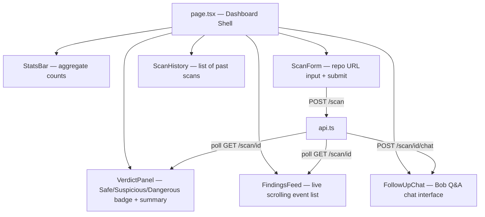
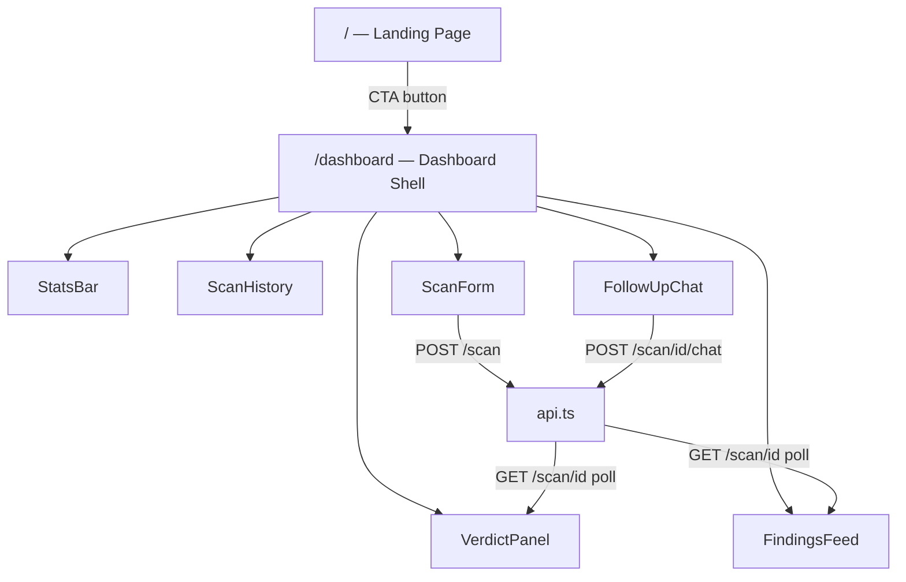

# npm i
npm
npm install
vm
postinstall
Sentinel Sandbox
Sentinel Sandbox
Disposable Assessment Sandbox-as-a-Service, powered by IBM Bob 2.0
IBM Bob 2.0 Hackathon — Team Submission Document
1. Problem Statement
Fake recruiters are exploiting the developer hiring process as an attack vector.
A typical case looks like this: 1. A “recruiter” contacts a developer through GitHub, claiming to represent
a company, offering a blockchain/backend developer role. 2. After a quick CV review, the intro call is
skipped entirely and the candidate is moved straight to a “technical assessment.” 3. The candidate is
invited to a private GitHub repository. 4. The repository instructs the candidate to run (or
-f ). 5. An lifecycle script ( postinstall ) silently launches a local server ( server.js ). 6. That server
imports a hidden loader, which fetches mutable JavaScript from remote infrastructure and executes
it via Function.constructor , with full access to Node’s require .
The result: arbitrary remote code execution, with the candidate’s own user privileges, on their
own machine — triggered by nothing more than following standard hiring instructions.
This is not a hypothetical. It’s a documented, repeatable attack chain that has now happened to a
member of our team 7 separate times. The repository itself never needs to contain the final payload —
only a loader — meaning the attacker can change what actually gets executed remotely, at any time,
without ever touching the GitHub repo again.
The core issue: developers have no safe way to complete a legitimate-looking take-home assessment
without exposing their real machine, real credentials, and real files to untrusted, possibly-malicious code.
2. Our Solution
Sentinel Sandbox gives candidates a way to actually run the assessment — safely — instead of just
warning them not to.
Instead of a static scanner that says “don’t install this,” Sentinel Sandbox automatically spins up a
disposable, isolated execution environment for every incoming assessment repository. The
candidate runs and the assessment exactly as instructed — but inside a throwaway
container that is destroyed immediately after, with zero access to the candidate’s real files, credentials,
or network beyond what’s explicitly permitted.
While the code runs, IBM Bob 2.0 actively monitors the environment in agent mode, tracing: - What
lifecycle scripts fire during install - What files get read, written, or executed - What network calls are
made, to where, and by which process - Whether dynamic code execution ( eval , Function() ,
module) occurs with remotely-fetched content
If a malicious chain is detected — such as a script triggering a loader that fetches and
executes remote code — Bob explains the full chain in plain language, in real time, before any real harm
is possible (because it already happened inside a disposable sandbox, not the candidate’s machine).
In short: we don’t block the workflow. We make the workflow safe.
3. Why This Is Different
npm i
Most existing tools (Snyk, Socket.dev, npm audit, etc.) perform static analysis — they read code and
flag known-bad patterns before you run anything. That’s useful, but: - They can miss loaders that fetch
mutable, remotely-hosted payloads (the actual malicious code isn’t in the repo at scan time). - They tell
you not to run something — they don’t give you a way to actually complete a legitimate task safely. -
None of them are built around the specific, real-world fake-recruitment attack vector — they treat all
code the same, regardless of delivery context.
Sentinel Sandbox is built specifically around this scenario: a candidate who legitimately needs to run
someone else’s code, under time pressure, as part of a real hiring process. We let them do that — safely
— while producing forensic-quality evidence of exactly what the code tried to do.
4. How IBM Bob 2.0 Is Used
Bob 2.0 is not a bolt-on feature — it’s the core reasoning engine of the product:
Agent mode: Bob actively monitors the sandboxed environment during execution, not just the
static source code, correlating file access, process spawning, and network activity into a single
coherent picture.
Repository & document understanding: Bob reads package.json , lifecycle scripts, and every file
the install process touches to understand structural context — e.g., recognizing that
imports a “loader” module, which is a common malicious pattern.
Parallel tasks / subagents: separate subagents can independently monitor filesystem activity,
network activity, and process activity in parallel, then a coordinating agent synthesizes the findings
into one attack-chain narrative.
Explanation layer: Bob translates raw technical findings (“ Function.constructor called with data
from fetch() ”) into a plain-language risk narrative a non-technical hiring manager or a junior
developer can understand immediately.
Interactive Q&A: after a scan, users can ask Bob follow-up questions — “What does this actually
do?”, “I already ran this, what should I do now?”, “Is this recruiter likely a scam?” — grounded
strictly in that specific scan’s findings.
5. Core Features (MVP Scope for the Hackathon)
Feature Description
Disposable sandbox Spins up an isolated container (Docker) per repository,
destroyed after the run
Live activity monitor Tracks file writes, process spawns, and network calls
during install/execution
Bob-powered chain tracing Connects multi-file execution paths into one coherent
attack narrative
Plain-language report Human-readable explanation of what the code did and
why it’s risky
Interactive Q&A Ask Bob follow-up questions grounded in the specific scan
Verdict Deterministic Safe / Suspicious / Dangerous rating based
on fixed detection rules (not left to the LLM to decide)
Explicitly out of scope for the 48-hour build: production-grade cloud infrastructure, persistent user
accounts, a public community threat database. These are natural “future work” extensions, not MVP
requirements.
6. Architecture Overview
server.js
┌─────────────────────────┐
│ GitHub Repo (input) │
└────────────┬─────────────┘
│
▼
┌─────────────────────────┐
│ Disposable Sandbox │ ← Docker container, isolated network,
│ (execution environment) │ no access to host filesystem
└────────────┬─────────────┘
│ runtime activity (files / network / processes)
▼
┌─────────────────────────┐
│ Bob 2.0 — Agent Mode │ ← subagents monitor in parallel,
│ (chain tracing engine) │ coordinator synthesizes findings
└────────────┬─────────────┘
│ structured findings
▼
┌─────────────────────────┐
│ Deterministic Rule Engine │ ← Safe / Suspicious / Dangerous verdict
└────────────┬─────────────┘
┌─────────────────────────┐
│ LLM Explanation Layer │ ← plain-language report + Q&A chat
└────────────┬─────────────┘
┌─────────────────────────┐
│ Dashboard / Report UI │ ← visual chain + verdict + chat
└─────────────────────────┘
7. Team Structure (6 Members)
Role Responsibility
Sandbox Engineer (x1) Docker container setup, isolation, activity capture hooks
Sandbox Engineer (x1) Network/file/process monitoring instrumentation
Bob Integration Lead (x1) Agent mode setup, subagent coordination, chain-tracing
logic
Bob Integration / LLM Layer (x1) Explanation layer + interactive Q&A grounding
Frontend/Dashboard (x1) Report UI, live activity visualization, chat interface
Docs & Demo Lead (x1) Problem/Solution statement, Bob Usage statement, demo
repo, video, screenshots from all members
8. 48-Hour Timeline
Time Milestone
Fri, kickoff Team briefing, role assignment, repo setup, agree on data
contracts between modules
Sat AM–PM Parallel build: sandbox infra, Bob agent integration,
explanation layer
Sat evening First integration: sandbox → Bob → rule engine pipeline
working end-to-end
Sun AM Frontend/dashboard + Q&A chat finished, docs lead
finalizes IOC patterns and statements
│
▼
│
▼
Sun midday Full integration test using a safe, self-built mock
“malicious” repository
Sun afternoon Record 3-minute demo video, capture Bob task-session
screenshots from every member, finalize slides & cover
image
Sun, by 8:00 PM PKT Submit on lablab.ai
9. Demo Plan
For safety and reproducibility, the team will build its own sanitized mock “malicious” repository (a
harmless dummy payload, e.g. writing a test file) rather than using any real attacker infrastructure or live
indicators of compromise. The demo will show: 1. A normal, safe repository scanned → clean pass. 2. The
mock malicious repository run inside the sandbox → Bob detects and explains the full chain in real time.
3. A follow-up question asked to Bob in the chat interface, answered using only that scan’s findings.
10. Judging Criteria Alignment
Application of Technology — Bob 2.0’s agent mode, subagents, and repository understanding are
core to the product, not decorative.
Business Value — solves a real, validated, repeatable attack vector; protects both candidates and
hiring companies.
Originality — inverts the usual “block and warn” approach into “let it run, but safely,” which
existing static scanners don’t do.
Presentation — live visual chain tracing and an interactive chat make the demo concrete and easy
to follow, even for non-technical judges. i want to design a frontend

---

**Status:** active  **Date:** 2026-09-26

---

### 👤 User

npm i
npm
npm install
vm
postinstall
Sentinel Sandbox
Sentinel Sandbox
Disposable Assessment Sandbox-as-a-Service, powered by IBM Bob 2.0
IBM Bob 2.0 Hackathon — Team Submission Document
1. Problem Statement
Fake recruiters are exploiting the developer hiring process as an attack vector.
A typical case looks like this: 1. A “recruiter” contacts a developer through GitHub, claiming to represent
a company, offering a blockchain/backend developer role. 2. After a quick CV review, the intro call is
skipped entirely and the candidate is moved straight to a “technical assessment.” 3. The candidate is
invited to a private GitHub repository. 4. The repository instructs the candidate to run (or
-f ). 5. An lifecycle script ( postinstall ) silently launches a local server ( server.js ). 6. That server
imports a hidden loader, which fetches mutable JavaScript from remote infrastructure and executes
it via Function.constructor , with full access to Node’s require .
The result: arbitrary remote code execution, with the candidate’s own user privileges, on their
own machine — triggered by nothing more than following standard hiring instructions.
This is not a hypothetical. It’s a documented, repeatable attack chain that has now happened to a
member of our team 7 separate times. The repository itself never needs to contain the final payload —
only a loader — meaning the attacker can change what actually gets executed remotely, at any time,
without ever touching the GitHub repo again.
The core issue: developers have no safe way to complete a legitimate-looking take-home assessment
without exposing their real machine, real credentials, and real files to untrusted, possibly-malicious code.
2. Our Solution
Sentinel Sandbox gives candidates a way to actually run the assessment — safely — instead of just
warning them not to.
Instead of a static scanner that says “don’t install this,” Sentinel Sandbox automatically spins up a
disposable, isolated execution environment for every incoming assessment repository. The
candidate runs and the assessment exactly as instructed — but inside a throwaway
container that is destroyed immediately after, with zero access to the candidate’s real files, credentials,
or network beyond what’s explicitly permitted.
While the code runs, IBM Bob 2.0 actively monitors the environment in agent mode, tracing: - What
lifecycle scripts fire during install - What files get read, written, or executed - What network calls are
made, to where, and by which process - Whether dynamic code execution ( eval , Function() ,
module) occurs with remotely-fetched content
If a malicious chain is detected — such as a script triggering a loader that fetches and
executes remote code — Bob explains the full chain in plain language, in real time, before any real harm
is possible (because it already happened inside a disposable sandbox, not the candidate’s machine).
In short: we don’t block the workflow. We make the workflow safe.
3. Why This Is Different
npm i
Most existing tools (Snyk, Socket.dev, npm audit, etc.) perform static analysis — they read code and
flag known-bad patterns before you run anything. That’s useful, but: - They can miss loaders that fetch
mutable, remotely-hosted payloads (the actual malicious code isn’t in the repo at scan time). - They tell
you not to run something — they don’t give you a way to actually complete a legitimate task safely. -
None of them are built around the specific, real-world fake-recruitment attack vector — they treat all
code the same, regardless of delivery context.
Sentinel Sandbox is built specifically around this scenario: a candidate who legitimately needs to run
someone else’s code, under time pressure, as part of a real hiring process. We let them do that — safely
— while producing forensic-quality evidence of exactly what the code tried to do.
4. How IBM Bob 2.0 Is Used
Bob 2.0 is not a bolt-on feature — it’s the core reasoning engine of the product:
Agent mode: Bob actively monitors the sandboxed environment during execution, not just the
static source code, correlating file access, process spawning, and network activity into a single
coherent picture.
Repository & document understanding: Bob reads package.json , lifecycle scripts, and every file
the install process touches to understand structural context — e.g., recognizing that
imports a “loader” module, which is a common malicious pattern.
Parallel tasks / subagents: separate subagents can independently monitor filesystem activity,
network activity, and process activity in parallel, then a coordinating agent synthesizes the findings
into one attack-chain narrative.
Explanation layer: Bob translates raw technical findings (“ Function.constructor called with data
from fetch() ”) into a plain-language risk narrative a non-technical hiring manager or a junior
developer can understand immediately.
Interactive Q&A: after a scan, users can ask Bob follow-up questions — “What does this actually
do?”, “I already ran this, what should I do now?”, “Is this recruiter likely a scam?” — grounded
strictly in that specific scan’s findings.
5. Core Features (MVP Scope for the Hackathon)
Feature Description
Disposable sandbox Spins up an isolated container (Docker) per repository,
destroyed after the run
Live activity monitor Tracks file writes, process spawns, and network calls
during install/execution
Bob-powered chain tracing Connects multi-file execution paths into one coherent
attack narrative
Plain-language report Human-readable explanation of what the code did and
why it’s risky
Interactive Q&A Ask Bob follow-up questions grounded in the specific scan
Verdict Deterministic Safe / Suspicious / Dangerous rating based
on fixed detection rules (not left to the LLM to decide)
Explicitly out of scope for the 48-hour build: production-grade cloud infrastructure, persistent user
accounts, a public community threat database. These are natural “future work” extensions, not MVP
requirements.
6. Architecture Overview
server.js
┌─────────────────────────┐
│ GitHub Repo (input) │
└────────────┬─────────────┘
│
▼
┌─────────────────────────┐
│ Disposable Sandbox │ ← Docker container, isolated network,
│ (execution environment) │ no access to host filesystem
└────────────┬─────────────┘
│ runtime activity (files / network / processes)
▼
┌─────────────────────────┐
│ Bob 2.0 — Agent Mode │ ← subagents monitor in parallel,
│ (chain tracing engine) │ coordinator synthesizes findings
└────────────┬─────────────┘
│ structured findings
▼
┌─────────────────────────┐
│ Deterministic Rule Engine │ ← Safe / Suspicious / Dangerous verdict
└────────────┬─────────────┘
┌─────────────────────────┐
│ LLM Explanation Layer │ ← plain-language report + Q&A chat
└────────────┬─────────────┘
┌─────────────────────────┐
│ Dashboard / Report UI │ ← visual chain + verdict + chat
└─────────────────────────┘
7. Team Structure (6 Members)
Role Responsibility
Sandbox Engineer (x1) Docker container setup, isolation, activity capture hooks
Sandbox Engineer (x1) Network/file/process monitoring instrumentation
Bob Integration Lead (x1) Agent mode setup, subagent coordination, chain-tracing
logic
Bob Integration / LLM Layer (x1) Explanation layer + interactive Q&A grounding
Frontend/Dashboard (x1) Report UI, live activity visualization, chat interface
Docs & Demo Lead (x1) Problem/Solution statement, Bob Usage statement, demo
repo, video, screenshots from all members
8. 48-Hour Timeline
Time Milestone
Fri, kickoff Team briefing, role assignment, repo setup, agree on data
contracts between modules
Sat AM–PM Parallel build: sandbox infra, Bob agent integration,
explanation layer
Sat evening First integration: sandbox → Bob → rule engine pipeline
working end-to-end
Sun AM Frontend/dashboard + Q&A chat finished, docs lead
finalizes IOC patterns and statements
│
▼
│
▼
Sun midday Full integration test using a safe, self-built mock
“malicious” repository
Sun afternoon Record 3-minute demo video, capture Bob task-session
screenshots from every member, finalize slides & cover
image
Sun, by 8:00 PM PKT Submit on lablab.ai
9. Demo Plan
For safety and reproducibility, the team will build its own sanitized mock “malicious” repository (a
harmless dummy payload, e.g. writing a test file) rather than using any real attacker infrastructure or live
indicators of compromise. The demo will show: 1. A normal, safe repository scanned → clean pass. 2. The
mock malicious repository run inside the sandbox → Bob detects and explains the full chain in real time.
3. A follow-up question asked to Bob in the chat interface, answered using only that scan’s findings.
10. Judging Criteria Alignment
Application of Technology — Bob 2.0’s agent mode, subagents, and repository understanding are
core to the product, not decorative.
Business Value — solves a real, validated, repeatable attack vector; protects both candidates and
hiring companies.
Originality — inverts the usual “block and warn” approach into “let it run, but safely,” which
existing static scanners don’t do.
Presentation — live visual chain tracing and an interactive chat make the demo concrete and easy
to follow, even for non-technical judges. i want to design a frontend

---

### 🤖 Assistant

> 🔧 called: use_skill

> 🔧 **use_skill** — create-plan

### 🤖 Assistant

> 🔧 called: spawn_subagent

Let me first explore the existing frontend codebase to understand what's already been built.

> 🔧 **spawn_subagent** — explore

### 🤖 Assistant

> 🔧 called: ask_followup_question

Good — the entire frontend is a blank slate. Now let me ask a few targeted clarifying questions before writing the plan.

### 🤖 Assistant

The backend API is at `http://localhost:8000`. Do you have an existing backend already, and if so, what endpoints does it expose? (e.g. POST /scan, GET /scan/:id, POST /chat, etc.)

> 🔧 **ask_followup_question** — The backend API is at `http://localhost:8000`. Do you have an existing backend already, and if so, what endpoints does it expose? (e.g. POST /scan, GET /scan/:id, POST /chat, etc.)

### 🤖 Assistant

> 🔧 called: ask_followup_question

### 🤖 Assistant

What does GET /scan/{id} return? What shape are the findings, verdict, and scan status fields? Do you have a sample response JSON?

> 🔧 **ask_followup_question** — What does GET /scan/{id} return? What shape are the findings, verdict, and scan status fields? Do you have a sample response JSON?

### 🤖 Assistant

> 🔧 called: ask_followup_question

> 🔧 **ask_followup_question** — done

### 🤖 Assistant

> 🔧 called: ask_followup_question

### 🤖 Assistant

What should a single "finding" event look like? What fields does it have — type, severity, message, timestamp, process? Also, should the frontend poll GET /scan/{id} on a timer to show live progress, or is there a WebSocket/SSE feed?

> 🔧 **ask_followup_question** — What should a single "finding" event look like? What fields does it have — type, severity, message, timestamp, process? Also, should the frontend poll GET /scan/{id} on a timer to show live progress, or is there a WebSocket/SSE feed?

### 🤖 Assistant

> 🔧 called: ask_followup_question

### 🤖 Assistant

What is the preferred visual style for the dashboard? This will inform color palette, layout, and component choices.

> 🔧 **ask_followup_question** — What is the preferred visual style for the dashboard? This will inform color palette, layout, and component choices.

### 🤖 Assistant

> 🔧 called: ask_followup_question

### 🤖 Assistant

Should the frontend include a scan history list (ScanHistory component exists) that persists previous scans, and a stats bar (StatsBar component exists) showing aggregate numbers like total scans / dangerous / safe? Or are these stretch goals?

> 🔧 **ask_followup_question** — Should the frontend include a scan history list (ScanHistory component exists) that persists previous scans, and a stats bar (StatsBar component exists) showing aggregate numbers like total scans / dangerous / safe? Or are these stretch goals?

### 🤖 Assistant

> 🔧 called: ask_followup_question

### 🤖 Assistant

Should the frontend install any additional UI libraries (e.g. lucide-react for icons, clsx for class merging, react-markdown for rendering the chain narrative), or should it stay with plain Tailwind and React only?

> 🔧 **ask_followup_question** — Should the frontend install any additional UI libraries (e.g. lucide-react for icons, clsx for class merging, react-markdown for rendering the chain narrative), or should it stay with plain Tailwind and React only?

### 🤖 Assistant

> 🔧 called: write_file

I now have enough context to write the plan. Let me design the full picture first.

Now writing the plan file:

---

### 👤 User

can u add landing page too? first

---

### 🤖 Assistant

> 🔧 called: ask_followup_question

### 🤖 Assistant

What should the landing page include? Pick the scope that fits best.

> 🔧 **ask_followup_question** — What should the landing page include? Pick the scope that fits best.

### 🤖 Assistant

> 🔧 called: write_file

Now I have everything I need. Writing the full plan file.

> 🔧 **write_file** — frontend-plan.md

### 🤖 Assistant

Here's the full plan. Let me walk you through it:

---

## Architecture

---

## Plan Summary — 8 Sub-Tasks

| # | Sub-Task | What it does |
|---|----------|--------------|
| 1 | **Foundation** | Install `lucide-react`, `clsx`, `react-markdown` · Define all TypeScript types · API client (`startScan`, `getScan`, `sendChat`) · `layout.tsx` · `globals.css` color tokens |
| 2 | **Landing Page** | Hero · Threat-stat strip · How It Works (3 steps) · Features grid (6 cards) · Footer · CTA → `/dashboard` |
| 3 | **Dashboard Shell** | `/dashboard` route · 2-column layout · `activeScanId` + `scanResult` state · 2-second polling loop |
| 4 | **ScanForm** | Repo URL input · calls `startScan` · loading/error states |
| 5 | **VerdictPanel** | Verdict badge (green/amber/red) · Bob summary · `chain` rendered as markdown · skeleton loading |
| 6 | **FindingsFeed** | Scrollable live findings list · severity icons · auto-scroll · empty state |
| 7 | **FollowUpChat** | Chat thread · user/Bob bubbles · typing indicator · `sendChat` |
| 8 | **ScanHistory + StatsBar** | Past-scan list · aggregate stat tiles · wire history state in dashboard |

---

**Sub-tasks 4–8 are independent of each other** and can be built in any order after the shell (Sub-Task 3) exists.

A few things to confirm before we implement:

1. **Routing** — I've put the dashboard at `/dashboard` and the landing page at `/`. Does that work, or should the dashboard be the root route?
2. **Scan history persistence** — I've designed history as in-memory React state (resets on page refresh). Is that acceptable for the hackathon MVP, or do you want `localStorage` persistence?
3. **`GET /scan/{id}` polling vs. SSE** — I've planned a 2-second poll. Is that confirmed, or does the backend support SSE/WebSocket for live findings?

Once you confirm, switch to **Agent mode** to implement.